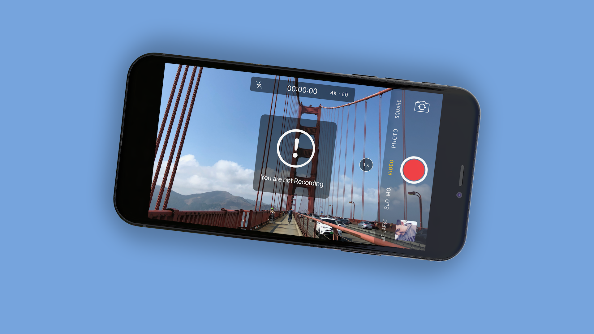
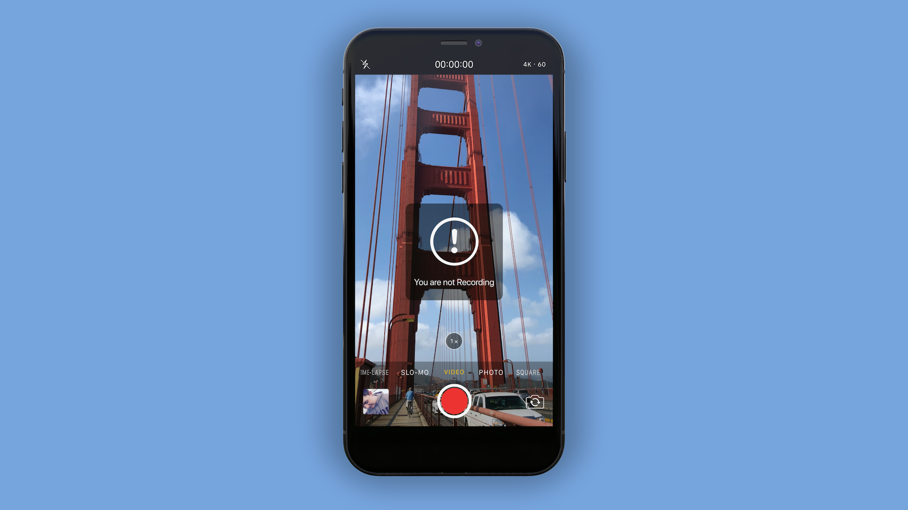

# NotRecording

## Description

Have you ever recorded a video and were holding up your iPhone and after you wanted to end the recording you realized: „Dammit, I was holding up my iPhone the whole time and haven’t recorded anything“. 

Well, this should not happen anymore with this Tweak. NotRecording adds an obtrusive banner to the video viewfinder to tell you that you are not recording a video.

This Tweak also prevents people at concerts from telling you that you are not recording 😅
                                 

## In Action

You can see the Tweak In Action below. It supports both Portait and Landscape orientation.

